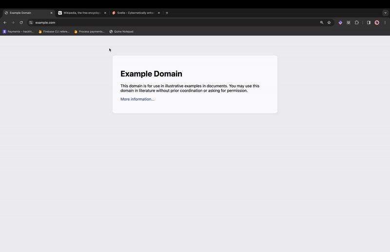

# TRUE SERVERLESS #

## The Why
Sick of hearing the constant marketing circle-jerk of "serverless" sites, I set out to test whether a truly server-free client only website is possible.

> It is. 

But that's not nearly enough. 

I wanted to create a true serverless site that also fit the following criteria:
- NO SERVER
- NO DATABASE
- ZERO Third party API calls
- Easy to use
- Stateful: It can have state and maintain its state when turned off
- History
- Cross Device: It can work cross devices 
- Self hosting (A Quine)

## The How
To achieve this I created a Bookmarklet (executable browser bookmark), that is a state-remembering quine (It outputs its own source code including current state and this output itself can be run as another program), that can sync across devices (using browser profile bookmark syncing), and to save state you simply drag a new bookmark into the bookmarks bar (easy to use) which is automatically timestamped and named for history purposes.

## How to run it?
Basically once you have saved the code to a bookmark, you click the bookmark and it will run the code. Then you just interact with the notepad and write whatever. When you want to save, you drag the link at the bottom to the bookmarks bar and it will auto name it. Then, at a later stage you can click the new bookmark and it will rerun the original program, but with you previous state.

You can share the link with friends and they can run it too. And if you have profile sync on, the bookmarklet should show up in the same browser on your other devices.

## Bold claims
I think its a world first? Happy to be proven wrong.

## Closing remarks
The final working code is the code in "stateful_quine_with_link.js". If you want to try the website out for yourself, simply save this code as a new bookmark (this is the url portion) and click the bookmark to run. (Note: Whenever you copy code from the internet please do understand what it does before executing it)

## Next Steps
I want to make a Fully working Quine self hosted Python REPL bookmarklet that maintains its own history and state, as a next implementation of this project
